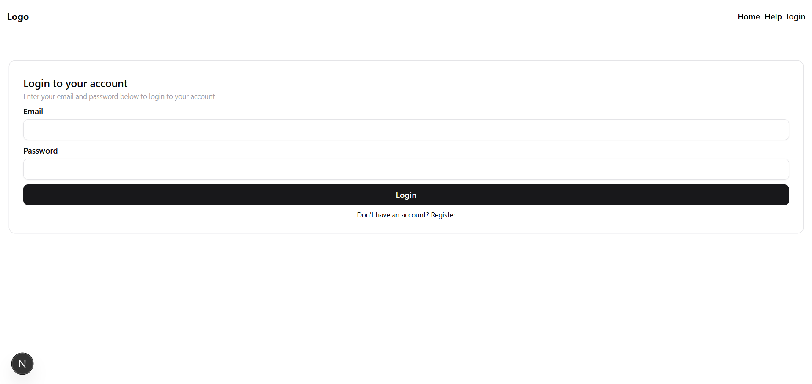

Got it ✅ — here’s a clean **README.md** you can copy–paste and adjust with your repo/project name:

---

# 📝 Complaint Management System

A full-stack **Next.js (TypeScript)** application that allows users to submit complaints and administrators to manage them.
Built with **MongoDB (Atlas)** for storage and **Nodemailer** for email notifications.

---

## 🚀 Features

- **User side**

  - Submit complaints with **Title, Description, Category, Priority**.

- **Admin side**

  - View all complaints in a table.
  - Filter by **status** or **priority**.
  - Update complaint status (**Pending → In Progress → Resolved**).
  - Delete complaints.

- **Emails**

  - Admin receives an email when a **new complaint** is submitted.
  - Admin receives an email when a **complaint status is updated**.

- **Responsive UI** (Tailwind CSS).

---

## 🛠️ Tech Stack

- **Frontend & Backend**: Next.js (TypeScript)
- **Database**: MongoDB (Atlas) via Mongoose
- **Emails**: Nodemailer (Gmail SMTP / any SMTP provider)
- **Styling**: Tailwind CSS
- **Auth (Optional)**: JWT for securing routes

---

## ⚙️ Setup Instructions

### 1️⃣ Clone the repo

```bash
git clone https://github.com/Abhiram86/complaint_register.git
cd complaint_register
```

### 2️⃣ Install dependencies

```bash
pnpm install
```

### 3️⃣ Configure environment variables

Create a `.env` file in the root:

```env
MONGODB_URI=your_mongodb_connection_string
EMAIL_USER=your_email@example.com
EMAIL_PASS=your_email_app_password
ADMIN_EMAIL=admin@example.com
JWT_SECRET=your_secret_key
```

### 4️⃣ Run locally

```bash
pnpm dev
```

App runs at 👉 [http://localhost:3000](http://localhost:3000)

---

## 📌 How to Use

### User Flow

1. Open the app → Fill out **Complaint Form** with Title, Description, Category, Priority.
2. Submit → Complaint is saved in MongoDB.
3. Admin receives an **email notification** with details.

### Admin Flow

1. Navigate to **Admin Dashboard**.
2. View all complaints in a table.
3. Filter by status/priority to manage easily.
4. Update a complaint’s status or delete it.
5. On status update, an **email is sent** confirming the update.

---

## 📷 Screenshots

### 1. Login Form

  
Simple login form for admin access to the dashboard.

---

### 2. Complaint Form (with success message)

  
User fills in **Title, Description, Category, Priority** and submits a complaint.  
A success message confirms that the complaint was submitted.

---

### 3. Email Notification to Admin

  
Admin receives an HTML-styled email with complaint details upon submission.

---

### 4. Admin Dashboard (Complaints Table)

  
Admin dashboard showing all complaints in a table with options to filter, update status, or delete complaints.

---

## 🌍 Deployment

You can deploy on:

- **Frontend**: [Vercel](https://complaint-register-jet.vercel.app/)

---

## ✅ Deliverables Checklist

- [x] CRUD operations with MongoDB
- [x] Email notifications (new + update)
- [x] Clean and responsive UI
- [x] Git workflow with commits, branches, PRs
- [x] JWT authentication (optional)
- [x] Live deployment link

---
